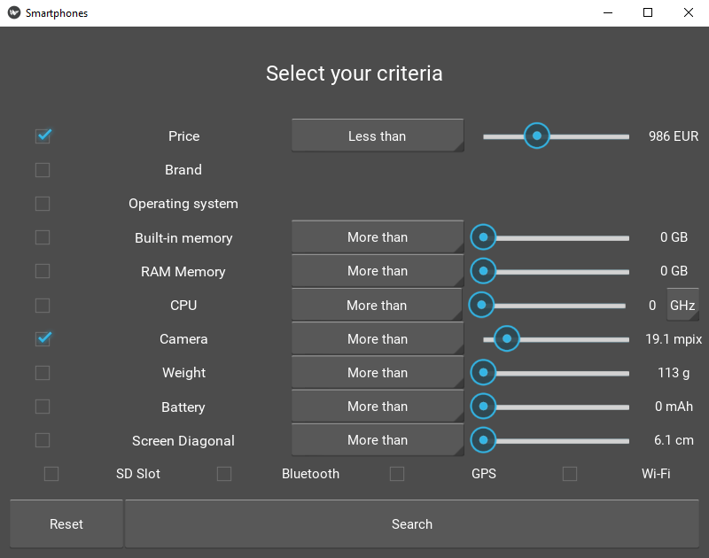
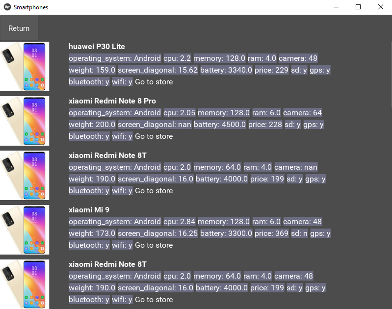

Program with visual interface for displaying data about smartphones from an online shop, using filters.

Visual interface with Kivy and Kivy Garden

Web scraping with BeautifulSoup

Expert system with Clips and ClipsPy

Data serialization with Pickle 

Views as of 31.08.2020

To do:
- ~~screen manager~~
- droplists for OS and brand
- ~~results view~~
- ~~sliders and params adjustments~~
- web scraping automatization
- ~~checkboxes activate on any item within line~~
- reset button impl.
- results view show criteria
- result item format + web scraping for image
- processor unit choice